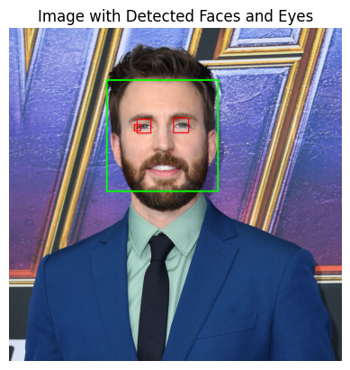

# Face and Eye Detection

## Overview
This project focuses on detecting faces and eyes in images using OpenCV and Haar cascades. It includes functions to detect faces, eyes, and both in an image.

## Prerequisites
- Python 
- OpenCV
- Matplotlib

## Example

1. **Original**

   

2. **Face Detection**

   

3. **Eyes Detection**

   

4. **Face and Eyes Detection**

   

## Maintainer
This project is maintained by Nithish Chowdary, a Senior Python Developer and AI/ML Engineer with over 10 years of experience in designing and deploying scalable machine learning models and computer vision solutions. His expertise includes deep learning, predictive modeling, and building robust backend services.

### Contact Information
- GitHub: https://github.com/NithishChowdary-Python-Dev
- LinkedIn: http://www.linkedin.com/in/nithishchowdary-python
- Email: nithishmc1@gmail.com